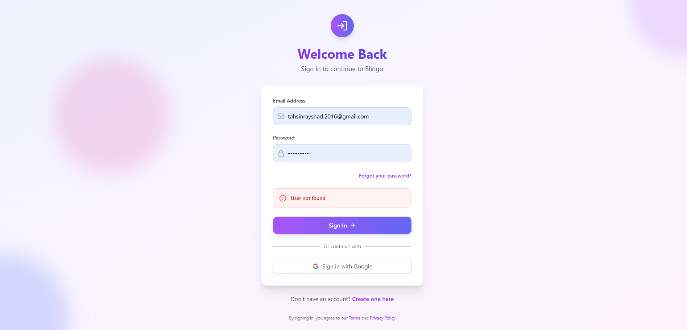
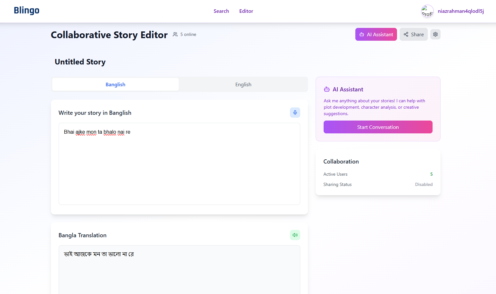

# **Blinglo: Banglish to Bangla Conversion App**

**Blinglo** is an innovative application designed to bridge the gap between Banglish (Bengali written in English alphabets) and Bangla. By seamlessly converting Banglish text to Bangla, Binglo allows users to communicate, create content, and explore the Bangla language effortlessly. The app incorporates a user-friendly interface, advanced translation algorithms, and modern features like chatbot integration and real-time collaboration, all while preserving the cultural essence of the language.

---

## **Key Features**

### **Authentication**
Secure user login and registration, along with protected API endpoints for a safe and personalized experience.


### **Banglish to Bangla Collaborative Story Editor**
A high-accuracy translation system that converts Banglish story into Bangla story seamlessly.


### **Content Management**
- **Banglish Text Editor**: Create content in Banglish and convert it into Bangla.
- **PDF Export**: Export translated content as PDFs with customizable visibility (Public/Private).
- **AI-Generated Titles and Captions**: Automatically generate titles and captions for PDFs.


### **Search Functionality**
Effortlessly search for PDFs and user profiles using both Banglish and Bangla queries.


### **Chatbot Integration**
An interactive chatbot that understands both Banglish and Bangla and responds exclusively in Bangla. The chatbot can also reference user-exported PDFs for queries.


### **Translation System Improvement**
A continuous learning system where users contribute new Banglish-to-Bangla text pairs, verified by admins to enhance the translation model.


### **UI/UX Design**
A sleek and responsive user interface designed for seamless navigation and a smooth user experience.


### **Backend and Infrastructure**
A scalable backend powered by MongoDB, using environment variables for efficient development and deployment.


---

## **Bonus Features**

### **Voice Interaction**
Enable hands-free content creation and Bangla voice assistant responses for a fully voice-interactive experience.


### **Smart Editor**
Auto-correction for common Banglish typing errors to ensure smooth writing and translations.


### **Real-Time Collaboration**
Collaborate with others in real-time to create and translate content.


### **Analytics Dashboard**
Track user activity and engagement through detailed analytics, providing insights into usage patterns.


### **Customizable Bangla Fonts**
Select from a variety of Bangla fonts to personalize your PDF exports.


### **Dockerization**
Containerized deployment ensures consistency across development, testing, and production environments.


---

## **Installation Instructions**

### **1. In the Root Directory:**
Install necessary dependencies by running:
```bash
npm install
