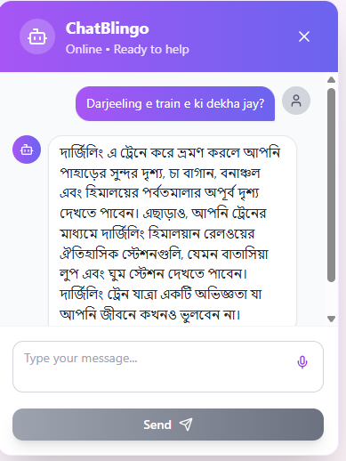
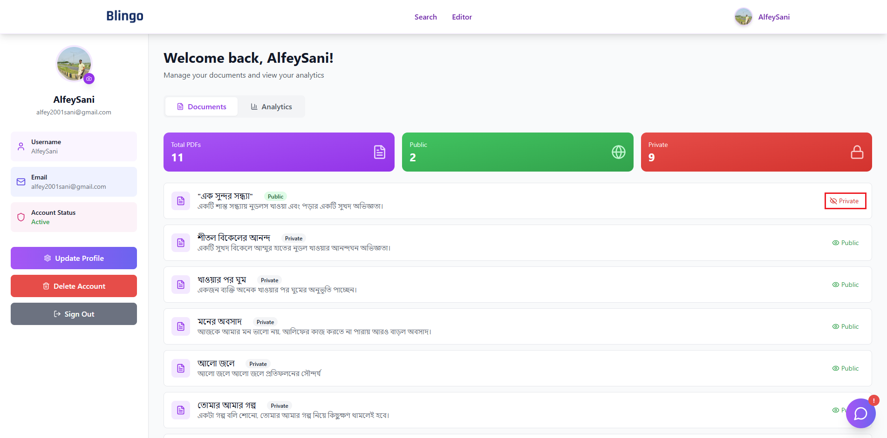
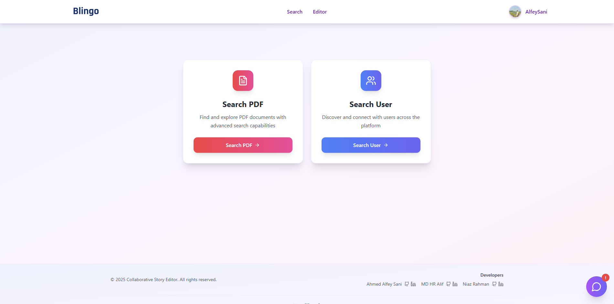
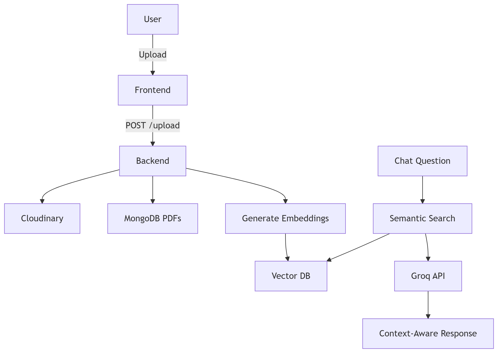
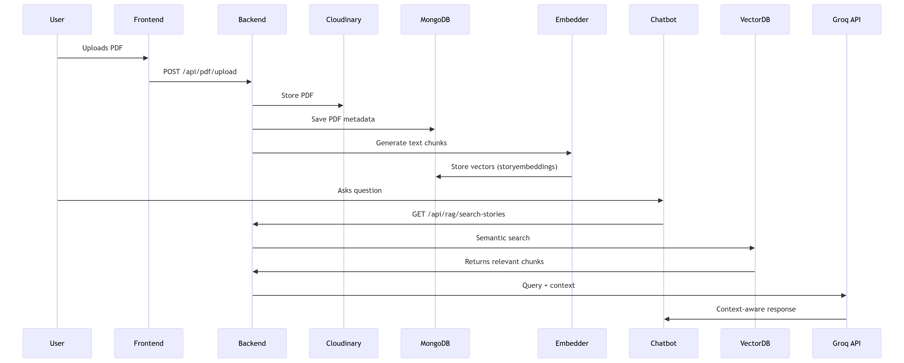

# Welcome to **Blingo**! 📖✨  

**Blingo** is an AI-powered collaborative story-writing platform designed for Bangla writers and storytellers. Whether you're crafting a story solo or collaborating with friends, **Blingo** provides powerful tools like **real-time translation (Banglish → Bangla), AI-generated titles, voice input, and an intelligent chatbot assistant** to enhance your creativity.  

🔹 **Write together** in a shared editor with access control.  
🔹 **Auto-translate** from Banglish to Bangla and listen to your story.  
🔹 **AI-powered assistance** for suggestions, feedback, and story ideas.  
🔹 **Smart chatbot** that learns from your stories and responds intelligently.  
🔹 **Save, download, and share** your stories with privacy controls.  
🔹 **Search** for users and stories effortlessly.  
🔹 **Analytical dashboard** to track your writing journey.  

Start crafting beautiful Bangla stories today!  

  

---

## 🚀 **Quick Start Guide**  

1. **Sign Up / Log In** – Create an account to save and manage your stories.  
2. **Start Writing** – Use the collaborative editor or write solo.  
3. **Translate & Listen** – Convert Banglish to Bangla and hear your story read aloud.  
4. **AI Assistance** – Get AI-generated titles, suggestions, and feedback.  
5. **Save & Share** – Download as PDF or share with others (public/private control).  
6. **Chat with AI** – Interact with a chatbot that understands your writing style.  
7. **Track Progress** – Check analytics on translations, stories, and interactions.  

---

## ✨ **Key Features**  

### **1. Collaborative Story Editor**  
- Real-time collaboration with access control.  
- Share stories via link with friends or co-authors.  

  

---  

### **2. Auto-Translation (Banglish → Bangla)**  
- Seamlessly convert written Banglish to proper Bangla.  
- Listen to the translated text with **text-to-speech**.  

  

---  

### **3. Voice Input & Audio Playback**  
- **Speak instead of typing** – supports voice input.  
- **Listen to your story** in Bangla for proofreading.  

  

---  

### **4. AI-Powered Story Assistance**  
- **AI-generated titles** for your stories.  
- **Smart suggestions** for plot, grammar, and creativity.  
- **Feedback & improvements** from AI.  

  

---  

### **5. Smart Chatbot (RAG-Powered)**  
- Learns from your past stories for personalized responses.  
- Supports **voice input** for natural conversations.  
- Helps with story ideas, corrections, and more.  

  

---  

### **6. Story Management & Privacy Controls**  
- **Save stories** to your profile.  
- **Download as PDF** (Bangla supported).  
- **Control visibility** (public/private stories).  

  

--- 

### **7. Search Functionality**  
- **Find users** and their public stories.  
- **Search stories** by keywords or genres.  

  

---  

### **8. Analytics Dashboard**  
- Visual insights on **translations, stories written, chatbot usage**.  
- Graphs and stats to track progress.  

  

---  

## 🛠 **Tech Stack**  

### **Frontend**  

  

### **Backend**  

### Voice & Audio

### **AI & NLP**  

---

## 🔍 **RAG Implementation**

**Retrieval-Augmented Generation** system that:
1. Stores user stories as vector embeddings
2. Retrieves relevant context for queries
3. Generates personalized Bangla/Banglish responses

  
*Figure 1: RAG System Workflow*

### **Key Components**
| Component | Technology | Purpose |
|-----------|------------|---------|
| Embedding Model | Xenova/all-MiniLM-L6-v2 | Text-to-vector conversion |
| Vector Database | MongoDB Atlas | Fast semantic search |
| LLM | Groq (Llama-3-70b) | Context-aware generation |

### **Data Flow**
  
*Figure 2: End-to-End Data Pipeline*

### **Why This Works**
- 💡 **Bangla-Optimized**: Handles code-mixing (Banglish) effectively
- 🔐 **Private**: Each user only accesses their own stories
- ⚡ **Fast**: Groq's LPU enables <1s responses
- 🧠 **Accurate**: Vector search finds relevant story segments
---
## 👥 Contributors

- [Ahmed Alfey Sani](https://github.com/AASani29)
- [Md Hasibur Rahman Alif](https://github.com/mdhralif) 
- [Niaz Rahman](https://github.com/niazbuoy08)

Want to contribute? Feel free to fork the repository and submit a pull request!

## 📄 License

**Blingo** is licensed under the MIT License. Open to all storytellers and creators!

**🌟 Let's Revolutionize Bangla Storytelling Together!**

At **Blingo**, we believe every story matters and every voice deserves to be heard. Start writing, collaborate freely, and let's create a vibrant community of Bangla storytellers together. ✍️🌍

Keep creating and sharing your stories! 📖💙
